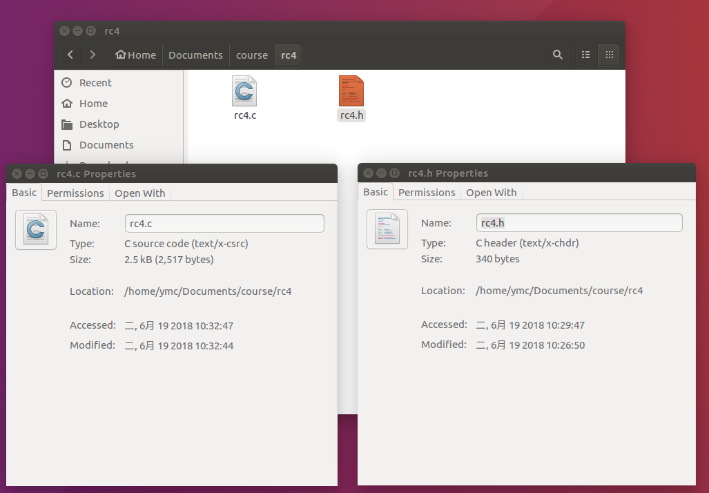
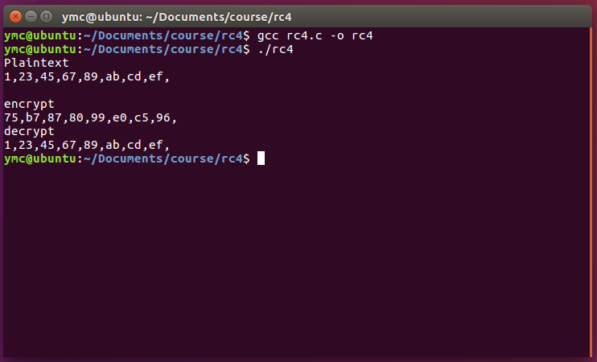

## C实现RC4加解密

### 【目的】
1. 用c实现RC4加解密
2. 标注函数的功能

### 【环境】
- 操作机：Ubuntu-crypto
- 密码：toor
- 参考代码存放位置：\Home\crypto\Documents\course

### 【工具】
- gcc

### 【原理】
RC4算法有下面几个部分构成：

- Sbox(S盒):256Byte(256个字节),Sbox是unsigned char类型的数据,该算法的关键的数据结构,构成加密操作的一个不可获取的结构.
- key(密钥):长度范围是[1 Byte,255 Byte]. 加密数据输入的密钥,任何加密数据里面都有密钥的存在.为的是使该算法的加密行更好一点,可以使密钥长度大一点,当密钥长度大于128位,就无法使用暴力破解的方式进行破解.
- inputByte/outputByte(要加密的数据/要解密的数据):该算法的特殊之处就在于加密和解密使用同一个算法,所以输入的是明文,输出的就是密文,输入的密文,输出的就是明文.
该算法的核心就是两部分:一个是伪随机数生成器,一个是异或操作.所以在我们实现的过程中,只需要实现这两个部分就可以了.

### 【实验步骤】
#### 1. 伪代码实现
该算法首先使用伪代码实现一下,然后在后边再使用c语言将伪代码实现出来.下面就是具体的伪代码的实现。
- 构造Sbox 作为RC4算法的最重要的部分,该算法的第一部分就是构造Sbox,实现的伪代码如下所示:
```c
for i from 0 to 255
    S[i] := i
  endfor
  j := 0
  for( i=0 ; i<256 ; i++)
    j := (j + S[i] + key[i mod keylength]) % 256
    swap values of S[i] and S[j]
endfor
```
构造Sbox的第一步就是先将初始化长度为256的sbox,然后为了制造伪随机数,使用输入的key,Sbox[i]和j的值(每次都会改变),这三个项结合在一起,将初始化后的Sbox打乱。

- 对数据进行异或运算，伪代码的实现如下所示:
```c
i := 0
j := 0
while GeneratingOutput:
    i := (i + 1) mod 256   // 1
    j := (j + S[i]) mod 256 // 2
    swap values of S[i] and S[j]  //3
    k := inputByte ^ S[(S[i] + S[j]) % 256] //4
    output K
endwhile
```
对数据进行异或操作主要在代码4处进行,代码1,2,3处的代码主要进行的工作也是对sbox进行处理,从这里看出,该算法的核心就是Sbox.

#### 2. 算法实现

**参考代码 rc4.h**
```c
#ifndef _SYS_CRYPTO_RC4_RC4_H_
#define _SYS_CRYPTO_RC4_RC4_H_

struct rc4_state {
    u_char  perm[256];
    u_char  index1;
    u_char  index2;
};

extern void rc4_init(struct rc4_state *state, const u_char *key, int keylen);
extern void rc4_crypt(struct rc4_state *state,
        const u_char *inbuf, u_char *outbuf, int buflen);

#endif
```
**参考代码 rc4.c**
```c
#include <sys/types.h>
#include "rc4.h"
#include <stdio.h>

static __inline void
swap_bytes(u_char *a, u_char *b)
{
    u_char temp;

    temp = *a;
    *a = *b;
    *b = temp;
}

/*
 * Initialize an RC4 state buffer using the supplied key,
 * which can have arbitrary length.
 */
void
rc4_init(struct rc4_state *const state, const u_char *key, int keylen)
{
    u_char j;
    int i;

    /* Initialize state with identity permutation */
    for (i = 0; i < 256; i++)
        state->perm[i] = (u_char)i; 
    state->index1 = 0;
    state->index2 = 0;

    /* Randomize the permutation using key data */
    for (j = i = 0; i < 256; i++) {
        j += state->perm[i] + key[i % keylen]; 
        swap_bytes(&state->perm[i], &state->perm[j]);
    }
}

/*
 * Encrypt some data using the supplied RC4 state buffer.
 * The input and output buffers may be the same buffer.
 * Since RC4 is a stream cypher, this function is used
 * for both encryption and decryption.
 */
void
rc4_crypt(struct rc4_state *const state,
    const u_char *inbuf, u_char *outbuf, int buflen)
{
    int i;
    u_char j;

    for (i = 0; i < buflen; i++) {

        /* Update modification indicies */
        state->index1++;
        state->index2 += state->perm[state->index1];

        /* Modify permutation */
        swap_bytes(&state->perm[state->index1],
            &state->perm[state->index2]);

        /* Encrypt/decrypt next byte */
        j = state->perm[state->index1] + state->perm[state->index2];
        outbuf[i] = inbuf[i] ^ state->perm[j];
    }
}

int main(int argc, char* argv[]){

    int dataLength = 8;
    int keyLength = 8;
    const unsigned char dataStream[8] = {0x01, 0x23, 0x45, 0x67, 0x89, 0xab, 0xcd, 0xef};
    printf("Plaintext\n");
    for (int i = 0; i < dataLength ; i++) {
        printf("%x,",dataStream[i]);
    }
    printf("\n");
    unsigned char encryp[dataLength];
    unsigned char decryp[dataLength];
    unsigned char key[8] = {0x01, 0x23, 0x45, 0x67, 0x89, 0xab, 0xcd, 0xef};
    struct rc4_state state;

    rc4_init(&state, key, keyLength);// this code is very important

    rc4_crypt(&state, dataStream, encryp, dataLength);
    printf("\nencrypt\n");
    for (int i = 0; i < dataLength ; i++) {
        printf("%x,",encryp[i]);
    }
    printf("\ndecrypt \n");
    rc4_init(&state, key, keyLength);// this code is very important
    rc4_crypt(&state, encryp, decryp, dataLength);
    for (int i = 0; i < dataLength ; i++) {
        printf("%x,",decryp[i]);
    }
    printf("\n");
    return 0;
}

```
1. 新建一个c文件和头文件，拷贝参考代码到文件中


2. 进入文件所在的目录，打开Terminal，编译文件
`gcc rc4.c -o rc4`

3. 执行文件`./rc4`


#### 3. 需要注意的地方

需要注意的地方就是在调用的时候,一定要注意构造Sbox,一开始在加密的时候,要初始化Sbox,在解密中,也要初始化Sbox 。如果在解密的时候没有初始化Sbox，在解密的时候，得出的结果是错误的。

原因分析:该算法的加解密都是基于Sbox,当在加密的过程当中,对Sbox,进行初始化,然后对数据进行加密,会改变Sbox中数据的顺序.所以进行解密的时候,要重新初始化Sbox,在进行解密,这意味着,只要密钥一样,每次初始化的Sbox都是一样的.这个可以从算法中看出来.调用的代码如下所示:
```c
int main(int argc, char* argv[]){

    int dataLength = 8;
    int keyLength = 8;
    const unsigned char dataStream[8] = {0x01, 0x23, 0x45, 0x67, 0x89, 0xab, 0xcd, 0xef};
    printf("before\n");
    for (int i = 0; i < dataLength ; i++) {
        printf("%x,",dataStream[i]);
    }
    printf("\n");
    unsigned char encryp[dataLength];
    unsigned char decryp[dataLength];
    unsigned char key[8] = {0x01, 0x23, 0x45, 0x67, 0x89, 0xab, 0xcd, 0xef};
    struct rc4_state state;

    rc4_init(&state, key, keyLength);// this code is very important

    rc4_crypt(&state, dataStream, encryp, dataLength);
    printf("\nencrypt\n");
    for (int i = 0; i < dataLength ; i++) {
        printf("%x,",encryp[i]);
    }
    printf("\ndecrypt \n");
    rc4_init(&state, key, keyLength);// this code is very important
    rc4_crypt(&state, encryp, decryp, dataLength);
    for (int i = 0; i < dataLength ; i++) {
        printf("%x,",decryp[i]);
    }
    printf("\n");
    return 0;
}
```
### 【总结】
在实现RC4的过程中,可能遇到的问题就是在解密的时候,怎么都不能正常的解密,原因就是没有对Sbox进行重新初始化。我们一定要搞明白RC4算法的原理，从而实现RC4算法的加解密。
