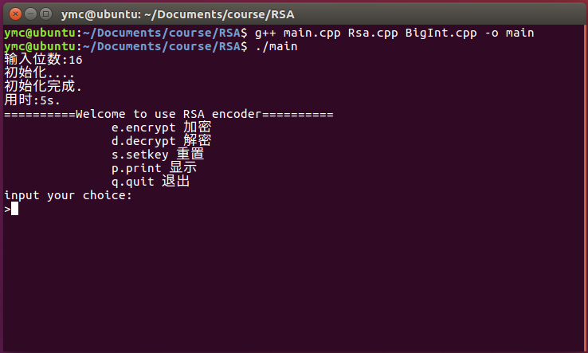
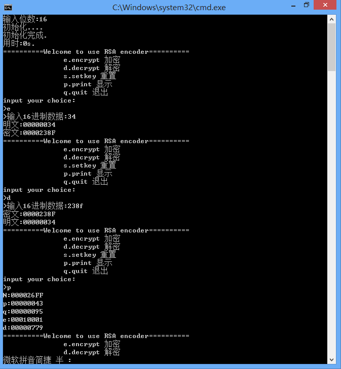

## RSA算法实验

### 【目的】
1. 能够生成大素数
2. 不能对p和q进行直接赋值
3. 至少实现256位RSA加密
4. 标注功能对应的算法

### 【环境】
- 操作机：Ubuntu-crypto
- 密码：toor
- 参考代码存放位置：\Home\crypto\Documents\course

### 【工具】
- g++

### 【原理】
RSA密钥的产生：
- 产生密钥时，需要考虑两个大素数p、q的选取，以及e的选取和d的计算。
因为n=pq在体制中是公开的，因此为了防止敌手通过穷搜索发现p、q，这两个素数应是在一个足够大的整数集合中选取的大数。如果选取p和q为$10^{100}$左右的大素数，那么n的阶为$10^{200}$，每个明文分组可以含有664位（$10^{200}\approx 2^{664}$），即83个8比特字节，这比DES的数据分组（8个8比特字节）大得多，这时就能看出RSA算法的优越性了。因此如何有效地寻找大素数是第一个需要解决的问题。
- 寻找大素数时一般是先随机选取一个大的奇数（例如用伪随机数产生器），然后用素性检验算法检验这一奇数是否为素数，如果不是则选取另一大奇数，重复这一过程，直到找到素数为止。素性检验算法通常都是概率性的，但如果算法被多次重复执行，每次执行时输入不同的参数，算法的检验结果都认为被检验的数是素数，那么就可以比较有把握地认为被检验的数是素数。
可见寻找大素数是一个比较繁琐的工作。然而在RSA体制中，只有在产生新密钥时才需执行这一工作。
p和q决定出后，下一个需要解决的问题是如何选取满足1<e<φ(n)和gcd(φ(n),e)=1的e，并计算满足d·e≡1 mod φ(n)的d。这一问题可由推广的Euclid算法完成。

### 【实验步骤】

#### 参考代码
- 1. 定义一个大整数类（BigInt）

BigInt.h
```c++
#pragma once
#include <vector>
#include <string>
#include <cassert>
#include <iostream>
#include <algorithm>
using std::ostream;
using std::vector;
using std::string;

class BigInt{

public:
	typedef unsigned long base_t;
	static int base_char;
	static int base;
	static int basebitnum;
	static int basebitchar;
	static int basebit;
private:
	friend class Rsa;
	friend void test();
public:
	friend BigInt operator + (const BigInt& a,const BigInt& b);
	friend BigInt operator - (const BigInt& a,const BigInt& b);
	friend BigInt operator * (const BigInt& a,const BigInt& b);
	friend BigInt operator / (const BigInt& a,const BigInt& b);
	friend BigInt operator % (const BigInt& a,const BigInt& b);
	friend bool operator < (const BigInt& a,const BigInt& b);
	friend bool operator <= (const BigInt& a,const BigInt& b);
	friend bool operator == (const BigInt& a,const BigInt& b);
	friend bool operator != (const BigInt& a,const BigInt& b){return !(a==b);}
	//重载版本
	friend BigInt operator + (const BigInt& a,const long b){BigInt t(b);return a+t;}
	friend BigInt operator - (const BigInt& a,const long b){BigInt t(b);return a-t;}
	friend BigInt operator * (const BigInt& a,const long b){BigInt t(b);return a*t;}
	friend BigInt operator / (const BigInt& a,const long b){BigInt t(b);return a/t;}
	friend BigInt operator % (const BigInt& a,const long b){BigInt t(b);return a%t;}
	friend bool operator < (const BigInt& a,const long b){BigInt t(b);return a<t;}
	friend bool operator <= (const BigInt& a,const  long b){BigInt t(b);return a<=t;}
	friend bool operator == (const BigInt& a,const long b){BigInt t(b);return a==t;}
	friend bool operator != (const BigInt& a,const long b){BigInt t(b);return !(a==t);};
	//
	friend ostream& operator << (ostream& out,const BigInt& a);
	friend BigInt operator <<(const BigInt& a,unsigned int n);
public:
	typedef vector<base_t> data_t;

	typedef const vector<base_t> const_data_t;
	BigInt& trim()
	{
		int count=0;
		//检查不为0的元素的数量
		for(data_t::reverse_iterator it=_data.rbegin();it!=_data.rend();++it)
			if((*it)==0)
				++count;
			else
				break;
		if(count==_data.size())//只有零的情况保留
			--count;
		for(int i=0;i<count;++i)
			_data.pop_back();
		return *this;
	}
	friend class bit;
	class bit
	{
	public:
		std::size_t size();
		bool at(std::size_t i);
		bit(const BigInt& a);
	private:
		vector<base_t> _bitvec;
		std::size_t _size;
	};
	//大数幂模运算
	BigInt moden(const BigInt& exp,const BigInt& p)const;
	/* 用扩展的欧几里得算法求乘法逆元 */
	BigInt extendEuclid(const BigInt& m);
public:
	BigInt():_isnegative(false){_data.push_back(0);}

	BigInt(const string& num):_data(),_isnegative(false){copyFromHexString(num);trim();}

	BigInt(const long n):_isnegative(false){copyFromLong(n);}

	BigInt(const_data_t data):_data(data),_isnegative(false){trim();}

	BigInt& operator =(string s)
	{
		_data.clear();
		_isnegative=false;
		copyFromHexString(s);
		trim();
		return *this;
	}
	BigInt(const BigInt& a,bool isnegative):_data(a._data),_isnegative(isnegative){}
	BigInt& operator =(const long n)
	{
		_data.clear();
		copyFromLong(n);
		return *this;
	}
public:
	static BigInt Zero;
	static BigInt One;
	static BigInt Two;
private:
	bool smallThan(const BigInt& a)const;//判断绝对值是否小于
	bool smallOrEquals(const BigInt& a)const;//判断绝对值是否小于相等
	bool equals(const BigInt& a)const;//判断绝对值是否相等

	BigInt& leftShift(const unsigned int n);
	BigInt& rightShift(const unsigned int n);
	BigInt& add(const BigInt& b);

	BigInt& sub(const BigInt& b);

	void copyFromHexString(const string& s)
	{
		string str(s);
		if(str.length() && str.at(0)=='-')
		{
			if(str.length()>1)
				_isnegative=true;
			str=str.substr(1);
		}
		int count=(8-(str.length()%8))%8;
		std::string temp;

		for(int i=0;i<count;++i)
			temp.push_back(0);

		str=temp+str;

		for(int i=0;i<str.length();i+=BigInt::base_char)
		{
			base_t sum=0;
			for(int j=0;j<base_char;++j)
			{
				char ch=str[i+j];

				ch=hex2Uchar(ch);
				sum=((sum<<4)|(ch));
			}
			_data.push_back(sum);
		}
		reverse(_data.begin(),_data.end());
	}
	char hex2Uchar(char ch)
	{
		static char table[]={0x00,0x01,0x02,0x03,0x04,0x05,0x06,0x07,0x08,0x09,0x0a,0x0b,0x0c,0x0d,0x0e,0x0f};
		if(isdigit(ch))
			ch-='0';
		else if(islower(ch))
			ch-='a'-10;
		else if(isupper(ch))
			ch-='A'-10;

		return table[ch];
	}

	void copyFromLong(const long n)
	{
		long a=n;
		if(a<0)
		{
			_isnegative=true;
			a=-a;
		}
		do
		{
			BigInt::base_t ch=(a&(BigInt::base));
			_data.push_back(ch);
			a=a>>(BigInt::basebitnum);
		}while(a);
	}
	static void div(const BigInt& a,const BigInt& b,BigInt& result,BigInt& ca);
private:
	vector<base_t> _data;
	//数据存储
	bool _isnegative;
};
```
BigInt.cpp
```c++
#include"BigInt.h"
#include<cassert>

int BigInt::base_char=8;
int BigInt::base=0xFFFFFFFF;
int BigInt::basebit=5;//2^5
int BigInt::basebitchar=0x1F;
int BigInt::basebitnum=32;
BigInt BigInt::Zero(0);
BigInt BigInt::One(1);
BigInt BigInt::Two(2);

BigInt operator + (const BigInt& a,const BigInt& b)
{
	BigInt ca(a);
	return ca.add(b);
}

BigInt operator - (const BigInt& a,const BigInt& b)
{
	BigInt ca(a);
	return ca.sub(b);
}

BigInt operator * (const BigInt& a,const BigInt& b)
{
	if(a==(BigInt::Zero) || b==(BigInt::Zero))
		return BigInt::Zero;

	const BigInt &big=a._data.size()>b._data.size()?a:b;
	const BigInt &small=(&big)==(&a)?b:a;

	BigInt result(0);

	BigInt::bit bt(small);
	for(int i=bt.size()-1;i>=0;--i)
	{
		if(bt.at(i))
		{
			BigInt temp(big,false);
			temp.leftShift(i);
			//std::cout<<"tmp:"<<temp<<std::endl;
			result.add(temp);
			//std::cout<<"res:"<<result<<std::endl;
		}
	}
	result._isnegative=!(a._isnegative==b._isnegative);
	return result;
}

BigInt operator / (const BigInt& a,const BigInt& b)
{
	assert(b!=(BigInt::Zero));
	if(a.equals(b))//绝对值相等
		return (a._isnegative==b._isnegative)?BigInt(1):BigInt(-1);
	else if(a.smallThan(b))//绝对值小于
		return BigInt::Zero;
	else
	{
		BigInt result,ca;
		BigInt::div(a,b,result,ca);
		return result;
	}
}

BigInt operator % (const BigInt& a,const BigInt& b)
{
	assert(b!=(BigInt::Zero));
	if(a.equals(b))
		return BigInt::Zero;
	else if(a.smallThan(b))
		return a;
	else
	{
		BigInt result,ca;
		BigInt::div(a,b,result,ca);
		return ca;
	}
}

void BigInt::div(const BigInt& a,const BigInt& b,BigInt& result,BigInt& ca)
{
	//1.复制a,b
	BigInt cb(b,false);
	ca._isnegative=false;
	ca._data=a._data;

	BigInt::bit bit_b(cb);
	//位数对齐
	while(true)//绝对值小于
	{
		BigInt::bit bit_a(ca);
		int len=bit_a.size()-bit_b.size();
		BigInt temp;
		//找到移位的
		while(len>=0)
		{
			temp=cb<<len;
			if(temp.smallOrEquals(ca))
				break;
			--len;
		}
		if(len<0)
			break;
		BigInt::base_t n=0;
		while(temp.smallOrEquals(ca))
		{
			ca.sub(temp);
			++n;
		}
		BigInt kk(n);
		if(len)
			kk.leftShift(len);
		result.add(kk);
	}
	result.trim();
}

bool operator < (const BigInt& a,const BigInt& b)
{
	if(a._isnegative==b._isnegative)
	{
		if(a._isnegative==false)
			return a.smallThan(b);
		else
			return !(a.smallOrEquals(b));
	}
	else
	{
		if(a._isnegative==false)
			return true;
		else
			return false;
	}
}

bool operator <= (const BigInt& a,const BigInt& b)
{
	if(a._isnegative==b._isnegative)
	{//同号
		if(a._isnegative==false)
			return a.smallOrEquals(b);
		else
			return !(a.smallThan(b));
	}
	else//异号
	{
		if(a._isnegative==false)
			return true;
		else
			return false;
	}
}

bool operator == (const BigInt& a,const BigInt& b)
{
	return a._data==b._data && a._isnegative == b._isnegative;
}

ostream& operator << (ostream& out,const BigInt& a)
{
	static char hex[]={'0','1','2','3','4','5','6','7','8','9','A','B','C','D','E','F'};
	if(a._isnegative)
		out<<"-";
	BigInt::base_t T=0x0F;
	std::string str;
	for(BigInt::data_t::const_iterator it=a._data.begin();it!=a._data.end();++it)
	{
		BigInt::base_t ch=(*it);
		for(int j=0;j<BigInt::base_char;++j)
		{
			str.push_back(hex[ch&(T)]);
			ch=ch>>4;
		}
	}
	reverse(str.begin(),str.end());
	out<<str;
	return out;
}

BigInt operator <<(const BigInt& a,unsigned int n)
{
	BigInt ca(a);
	return ca.leftShift(n);
}

BigInt& BigInt::leftShift(const unsigned int n)
{
	int k=n>>(BigInt::basebit);//5
	int off=n&(BigInt::basebitchar);//0xFF

	int inc=(off==0)?k:1+k;
	for(int i=0;i<inc;++i)
		_data.push_back(0);

	if(k)
	{
		inc=(off==0)?1:2;
		for(int i=_data.size()-inc;i>=k;--i)
			_data[i]=_data[i-k];
		for(int i=0;i<k;++i)
			_data[i]=0;
	}

	if(off)
	{
		BigInt::base_t T=BigInt::base;//0xffffffff
		T=T<<(BigInt::basebitnum-off);//32
		//左移
		BigInt::base_t ch=0;
		for(std::size_t i=0;i<_data.size();++i)
		{
			BigInt::base_t t=_data[i];
			_data[i]=(t<<off)|ch;
			ch=(t&T)>>(BigInt::basebitnum-off);//32,最高位
		}
	}
	trim();
	return *this;
}

BigInt& BigInt::rightShift(const unsigned int n)
{
	int k=n>>(BigInt::basebit);//5
	int off=n&(BigInt::basebitchar);//0xFF

	if(k)
	{
		for(int i=0;i>k;++i)
			_data[i]=_data[i+k];
		for(int i=0;i<k;++i)
			_data.pop_back();
		if(_data.size()==0)
			_data.push_back(0);
	}

	if(off)
	{
		BigInt::base_t T=BigInt::base;//0xFFFFFFFF
		T=T>>(BigInt::basebitnum-off);//32
		//左移
		BigInt::base_t ch=0;
		for(int i=_data.size()-1;i>=0;--i)
		{
			BigInt::base_t t=_data[i];
			_data[i]=(t>>off)|ch;
			ch=(t&T)<<(BigInt::basebitnum-off);//32,最高位
		}
	}
	trim();
	return *this;
}

BigInt& BigInt::sub(const BigInt& b)
{
	if(b._isnegative==_isnegative)
	{//同号

		BigInt::data_t &res=_data;
		if(!(smallThan(b)))//绝对值大于b
		{
			int cn=0;//借位
			//大数减小数
			for(std::size_t i=0;i<b._data.size();++i)
			{
				BigInt::base_t temp=res[i];
				res[i]=(res[i]-b._data[i]-cn);
				cn=temp<res[i]?1:temp<b._data[i]?1:0;
			}

			for(std::size_t i=b._data.size();i<_data.size() && cn!=0;++i)
			{
				BigInt::base_t temp=res[i];
				res[i]=res[i]-cn;
				cn=temp<cn;
			}
			trim();
		}
		else//绝对值小于b
		{
			_data=(b-(*this))._data;
			_isnegative=!_isnegative;
		}
	}
	else
	{//异号的情况
		bool isnegative=_isnegative;
		_isnegative=b._isnegative;
		add(b);
		_isnegative=isnegative;
	}
	return *this;
}

BigInt& BigInt::add(const BigInt& b)
{
	if(_isnegative==b._isnegative)
	{//同号
		//引用
		BigInt::data_t &res=_data;
		int len=b._data.size()-_data.size();

		while((len--)>0)//高位补0
			res.push_back(0);

		int cn=0;//进位
		for(std::size_t i=0;i<b._data.size();++i)
		{
			BigInt::base_t temp=res[i];
			res[i]=res[i]+b._data[i]+cn;
			cn=temp>res[i]?1:temp>(temp+b._data[i])?1:0;//0xFFFFFFFF
		}

		for(std::size_t i=b._data.size();i<_data.size() && cn!=0;++i)
		{
			BigInt::base_t temp=res[i];
			res[i]=(res[i]+cn);
			cn=temp>res[i];
		}

		if(cn!=0)
			res.push_back(cn);

		trim();
	}
	else
	{//异号的情况
		bool isnegative;
		if(smallThan(b))//绝对值小于b
			isnegative=b._isnegative;
		else if(equals(b))//绝对值等于b
			isnegative=false;
		else//绝对值大于b
			isnegative=_isnegative;

		_isnegative=b._isnegative;
		sub(b);
		_isnegative=isnegative;
	}
	return *this;
}

BigInt BigInt::moden(const BigInt& exp,const BigInt& p)const
{//模幂运算
	BigInt::bit t(exp);

	BigInt d(1);
	for(int i=t.size()-1;i>=0;--i)
	{
		d=(d*d)%p;
		if(t.at(i))
			d=(d*(*this))%p;
	}
	return d;
}

BigInt BigInt::extendEuclid(const BigInt& m)
{//扩展欧几里得算法求乘法逆元
	assert(m._isnegative==false);//m为正数
	BigInt a[3],b[3],t[3];
	a[0] = 1; a[1] = 0; a[2] = m;
	b[0] = 0; b[1] = 1; b[2] = *this;
	if (b[2] == BigInt::Zero || b[2]==BigInt::One)
		return b[2];

	while(true)
	{
		if (b[2] == BigInt::One)
		{
			if(b[1]._isnegative==true)//负数
				b[1]=(b[1]%m+m)%m;
			return b[1];
		}

		BigInt q = a[2]/b[2];
		for(int i=0; i<3;++i)
		{
			t[i] = a[i] - q * b[i];
			a[i] = b[i];
			b[i] = t[i];
		}
	}
}

std::size_t BigInt::bit::size()
{
	return _size;
}

bool BigInt::bit::at(std::size_t i)
{
	std::size_t index=i>>(BigInt::basebit);
	std::size_t off=i&(BigInt::basebitchar);
	BigInt::base_t t=_bitvec[index];
	return (t&(1<<off));
}

BigInt::bit::bit(const BigInt& ba)
{
	_bitvec=ba._data;
	BigInt::base_t a=_bitvec[_bitvec.size()-1];//最高位
	_size=_bitvec.size()<<(BigInt::basebit);
	BigInt::base_t t=1<<(BigInt::basebitnum-1);

	if(a==0)
		_size-=(BigInt::basebitnum);
	else
	{
		while(!(a&t))
		{
			--_size;
			t=t>>1;
		}
	}
}

bool BigInt::smallThan(const BigInt& b)const
{
	if(_data.size()==b._data.size())
	{
		for(BigInt::data_t::const_reverse_iterator it=_data.rbegin(),it_b=b._data.rbegin();
			it!=_data.rend();++it,++it_b)
			if((*it)!=(*it_b))
				return (*it)<(*it_b);
		return false;//相等
	}
	else
		return _data.size()<b._data.size();
}

bool BigInt::smallOrEquals(const BigInt& b)const
{
	if(_data.size()==b._data.size())
	{
		for(BigInt::data_t::const_reverse_iterator it=_data.rbegin(),it_b=b._data.rbegin();
			it!=_data.rend();++it,++it_b)
			if((*it)!=(*it_b))
				return (*it)<(*it_b);
		return true;//相等
	}
	else
		return _data.size()<b._data.size();
}

bool BigInt::equals(const BigInt& a)const
{
	return _data==a._data;
}
```

- 2. 实现RSA加解密的算法

Rsa.h
```c++
#pragma once
#include "BigInt.h"
class Rsa
{
public:
	Rsa();
	~Rsa();
	void init(unsigned int n);//初始化，产生公私钥对

	friend void test();
public:
	BigInt encryptByPu(const BigInt& m);//私钥加密
	BigInt decodeByPr(const BigInt& c);//公钥解密

	BigInt encryptByPr(const BigInt& m);//公钥加密
	BigInt decodeByPu(const BigInt& m);//私钥解密
private:
	BigInt createOddNum(unsigned int n);//生成长度为n的奇数
	bool isPrime(const BigInt& a,const unsigned int k);//判断素数
	BigInt createPrime(unsigned int n,int it_cout);//生成长度为n的素数
	void createExp(const BigInt& ou);//从一个欧拉数中生成公钥、私钥指数
	BigInt createRandomSmallThan(const BigInt& a);//创建小数
	friend ostream& operator <<(ostream& out,const Rsa& rsa)//输出
	{
		out<<"N:"<<rsa.N<<"\n";
		out<<"p:"<<rsa._p<<"\n";
		out<<"q:"<<rsa._q<<"\n";
		out<<"e:"<<rsa.e<<"\n";
		out<<"d:"<<rsa._d;
		return out;
	}
public:
	BigInt e,N;//公钥
private:
	BigInt _d;//私钥
	BigInt _p,_q;//
	BigInt _ol;//欧拉数
};
```
Rsa.cpp
```c++
#include "Rsa.h"
#include<iostream>
#include<sstream>
#include<ctime>
#include<cstdlib>

using std::cout;
using std::endl;
using std::ostringstream;

Rsa::Rsa()
{
}

Rsa::~Rsa()
{
}

void Rsa::init(unsigned int n)
{
	srand(time(NULL));
	//产生大素数p、q
	_p=createPrime(n,10);
	_q=createPrime(n,10);
	//计算N
	N=_p*_q;
	//计算出欧拉数
	_ol=(_p-1)*(_q-1);
	//加密指数e
	createExp(_ol);
	//d
}

BigInt Rsa::createOddNum(unsigned int n)
{//生成长度为n的奇数
	n=n/4;
	static unsigned char hex_table[]={'0','1','2','3','4','5','6','7','8','9','A','B','C','D','E','F'};
	if(n)
	{
		ostringstream oss;
		for(std::size_t i=0;i<n-1;++i)
			oss<<hex_table[rand()%16];
		oss<<hex_table[1];
		string str(oss.str());
		return BigInt(str);
	}
	else
		return BigInt::Zero;
}

bool Rsa::isPrime(const BigInt& n,const unsigned int k)
{//判断素数
	assert(n!=BigInt::Zero);
	if(n==BigInt::Two)
		return true;

	BigInt n_1=n-1;
	BigInt::bit b(n_1);//二进制位
	if(b.at(0)==1)
		return false;

	for(std::size_t t=0;t<k;++t)
	{
		BigInt a=createRandomSmallThan(n_1);//随机数
		BigInt d(BigInt::One);
		for(int i=b.size()-1;i>=0;--i)
		{
			BigInt x=d;
			d=(d*d)%n;
			if(d==BigInt::One && x!=BigInt::One && x!=n_1)
				return false;

			if(b.at(i))
			{
				assert(d!=BigInt::Zero);
				d=(a*d)%n;
			}
		}
		if(d!=BigInt::One)
			return false;
	}
	return true;
}

BigInt Rsa::createRandomSmallThan(const BigInt& a)
{
	unsigned long t=0;
	do
	{
		t=rand();
	}while(t==0);

	BigInt mod(t);
	BigInt r=mod%a;
	if(r==BigInt::Zero)
		r=a-BigInt::One;
	return r;
}

BigInt Rsa::createPrime(unsigned int n,int it_count)
{//生成长度为n的素数
	assert(it_count>0);
	BigInt res=createOddNum(n);
	while(!isPrime(res,it_count))
	{
		res.add(BigInt::Two);
	}
	return res;
}

void Rsa::createExp(const BigInt& ou)
{//从一个欧拉数中生成公钥、私钥指数
	//e=5;
	e=65537;
	_d=e.extendEuclid(ou);
}

BigInt Rsa::encryptByPu(const BigInt& m)
{//公钥加密
	return m.moden(e,N);
}

BigInt Rsa::decodeByPr(const BigInt& c)
{//私钥解密
	return c.moden(_d,N);
}

BigInt Rsa::encryptByPr(const BigInt& m)
{//私钥加密
	return decodeByPr(m);
}

BigInt Rsa::decodeByPu(const BigInt& c)
{//公钥解密
	return encryptByPu(c);
}
```

- 3. main函数

```c++
#include <iostream>
#include <ctime>
#include "BigInt.h"
#include "Rsa.h"
using std::cout;
using std::endl;
using std::cin;

void menu()
{//菜单显示函数
	cout<<"==========Welcome to use RSA encoder=========="<<endl;
	cout<<"               e.encrypt 加密              "<<endl;
	cout<<"               d.decrypt 解密              "<<endl;
	cout<<"               s.setkey 重置               "<<endl;
	cout<<"               p.print 显示               "<<endl;
	cout<<"               q.quit 退出                 "<<endl;
	cout<<"input your choice:"<<endl;
}

bool islegal(const string& str)
{//判断输入是否合法
	for(string::const_iterator it=str.begin();it!=str.end();++it)
		if(!isalnum(*it))//不是字母数字
			return false;
	return true;
}

bool decode(Rsa& rsa)
{//解密
	string str;
	do
	{
		cout<<">输入16进制数据:";
		cin>>str;
	}while(cin && str.length()<1);
	if(!cin || islegal(str)==false)
		return false;
	BigInt c(str);

	long t1=clock();
	BigInt m=rsa.decodeByPr(c);
	long t2=clock();
	cout<<"用时:"<<(t2-t1)<<"ms."<<endl;

	cout<<"密文:"<<c<<endl
		<<"明文:"<<m<<endl;
	return true;
}

bool encry(Rsa& rsa,BigInt& c)
{//加密
	string str;
	do
	{
		cout<<">输入16进制数据:";
		cin>>str;
	}while(cin && str.length()<1);
	if(!cin || islegal(str)==false)
		return false;
	BigInt m(str);

	c=rsa.encryptByPu(m);

	cout<<"明文:"<<m<<endl
		<<"密文:"<<c<<endl;
	return true;
}

void print(Rsa& rsa)
{//输出
	cout<<rsa<<endl;
}

void init(Rsa& rsa,int n)
{//初始化

	cout<<"初始化...."<<endl;
	long t1=clock();
	rsa.init(n);
	long t2=clock();
	cout<<"初始化完成."<<endl;
	cout<<"用时:"<<(t2-t1)/1000<<"s."<<endl;
}

int go()
{//控制函数
	char ch;
	string str;
	Rsa rsa;
	BigInt c,m;
	cout<<"输入位数:";
	int n;
	cin>>n;
	init(rsa,n/2);

	while(true)
	{
		menu();//菜单显示
		cout<<">";
		cin>>str;
		if(!cin)
			return 0;

		if(str.length()<1)
			cout<<"重新输入"<<endl;
		else
		{
			ch=str.at(0);
			switch(ch)
			{
			case 'e':
			case 'E':
				encry(rsa,c);//加密
				break;
			case 'd':
			case 'D':
				decode(rsa);//解密
				break;
			case 's':
			case 'S':
				go();//重新开始初始
				break;
			case 'p':
			case 'P':
				print(rsa);//输出公私钥信息
				break;
			case 'q':
			case 'Q':
				return 0;
			}
		}
	}
}


int main()
{
	go();
}
```
1. 新建`BigInt.h`、`BigInt.cpp`、`Rsa.h`、`Rsa.cpp`、`main.cpp`文件，拷贝参考代码到文件中


2. 编译程序
`g++ main.cpp Rsa.cpp BigInt.cpp -o main`

3. 运行文件`./main`



#### （附加方法）Windows下的运行方式

1. 新建一个空白C++项目


2. 在头文件和源文件中分别添加新建项


3. 将解决方案的配置改为release，平台改为x86，点击本地windows调试器


4. 程序界面如图



（生成的`exe`文件在`Release`文件夹中）

### 【总结】

-通过本节实验，掌握了RSA算法的加密技术。可利用RSA算法对不同位数的RSA加密。
