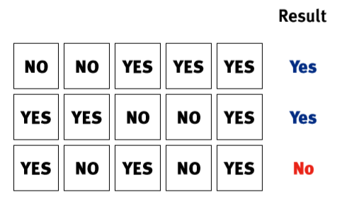
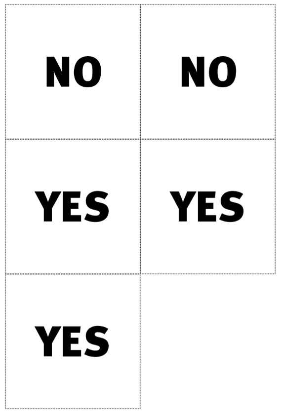
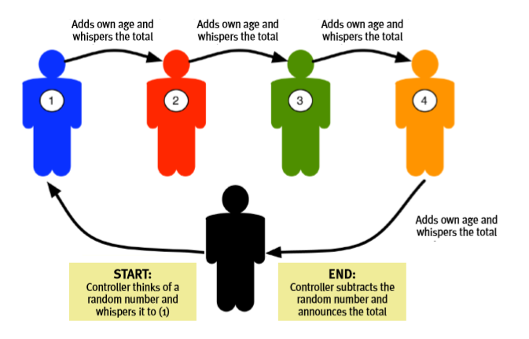
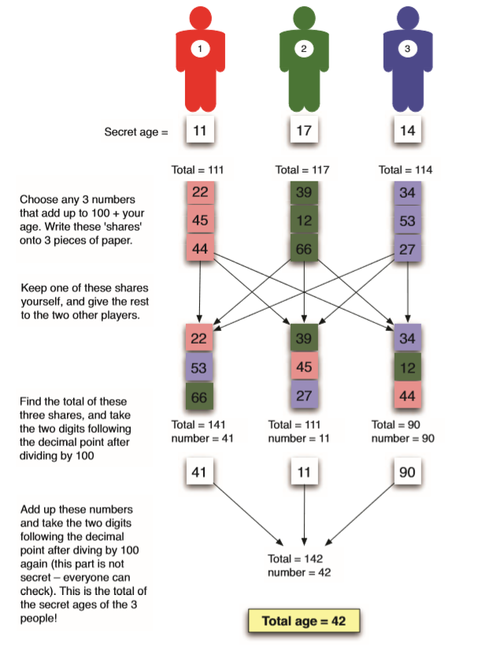

## 零知识证明实验

### 【目的】
1. 通过实验加深对零知识证明的认识

### 【环境】
无

### 【工具】
无

### 【原理】
安全在互联网上非常重要。 你经常需要向另一个人证明你知道某事但不让他们知道实际信息是什么（因为他们只能复制和使用它）。 例如，您可能需要说服一个在线音乐商店，您知道自己网站的密码，而不必自己发送密码。

这些被称为'零知识'方法，因为你可以得到一个答案，而不会发现任何关于重要信息的新东西。 在这里，我们提供两种零知识实验，您可以在家中或学校与朋友一起尝试。 第一种方法是找出两个人是否同意做出决定，但他们中的任何一方都没有透露他们真正决定的内容！ 第二个可以让你计算出所有年龄段的总人数，而不需要每个人都找出其他人的年龄。

### 【实验步骤】

#### 决定游戏

假设你和一位朋友必须做出“是”或“否”的联合决定，但你不希望其他人知道你的想法。 例如，你们两个人都需要决定是否一起度假，如果你不想去但他们愿意，你不想伤害他们的感受。你怎么知道你是否同意而不知道你俩是什么 答案是？ 通过玩决定游戏，就是这样！

**实验方法：**

下面显示了一组三张'是'卡和两张'没有'卡。打印页面并剪下卡片（或自己画）。现在，请按照以下步骤操作。
1. 需要作出决定的两个人中的每一个都需要一个“是”和一个“否”卡，剩下第三个“是”。 
2. 大声说出问题，以便你们都确切知道你在回答什么。 
3. 第一个人把他们的决定牌面朝下放在桌子上，他们的决定在上面。 
4. 现在将备用'Yes'卡片面朝下放置在堆的顶部。 
5. 第二个人把他们的决定牌面朝下放在一堆，他们的决定是作为下面的决定。 
6. 接下来，一堆牌被'切'（随机分开，顶牌放在底部）。根据你的喜好多次裁剪甲板，直到你确信你的牌是秘密的。现在，没有人看到他人的牌或他们被放在堆上的顺序。 
7. 翻过一堆，将牌分成一排，正面朝上，这样你们都可以看到它们。 
8. 如果所有三张'Yes'卡片都相邻，那么你们都决定'是'。由于堆被切割，纸牌环绕，即使'Yes'卡在边缘，仍然是肯定的结果。如果三张'有'卡被'无'卡分隔开，那么其中一方或另一方都决定'不'。决定游戏的美妙之处在于玩家永远不知道谁说'不'，所以没有人会感到尴尬或伤害！

#### 秘密年龄
这是一个零知识的游戏，用于增加人们的年龄，而不会发现其他人的年龄。 你只需要找出每个人的总数。 我们使用年龄，但游戏与个人可能想要保密的任何数字一起使用。 不用年龄，你可以用你自己的鞋子数量或你今天吃过多少饼干来试试这个。

你可以和任何数量的朋友一起做这件事，但这个例子涉及四个人。

**实验方法：**

1.四个有秘密年龄的人并排排列，面对第五个人，'管理员'（你的老师或另一个朋友）。
2.控制员考虑一个介于1到100之间的数字，并将其耳语在该线路中的第一个人的耳朵中。
3.第一个人将他们的年龄加上数字，然后将总数交给第二个人。
4.第二个人增加他们的年龄，然后把总数交给第三个人，然后第三个人做到第四个。
5.第四个人向控制器低声说出总计。 然后管理员拿走原始号码并向大家宣布总计是多少。

通过这种方式，已经发现了关于整个团队的年龄信息，但是无需任何人泄露他们的年龄！

这种零知识方法并不是非常安全。人们可能会欺骗并制定出一些所谓的秘密信息。 你如何看待这种情况？ 游戏结束后，哪些人可以聚在一起并制作关于其他玩家的秘密信息？

#### 进阶保密方法

如果你已经弄清楚如何在零知识系统中作弊，你能设计一个更安全的系统吗？ 下图中显示的方法稍微复杂一点，但对于作弊行为是安全的。 和你的同学试试看！

- 你需要三个不知道对方年龄的朋友，还有一个计算器。
- 每个玩家将他们的年龄增加100，然后将总数分成三个随机数（例如，年龄11,111 = 22 + 45 + 44）。
- 随机数字是“份额”，每个玩家都写在三张纸上。
- 每个参与者为自己保留一个份额，并为另外两个参与者分配其他份额。
- 每个玩家最后有三个份额，它们使用计算器重新计算，然后除以100.然后，他们保留小数点后的两位数字。 （如果小数点后面只有一位数字后面加零，例如0.9会给出90）。
- 所有玩家将结果编号显示给其他人。
- 球员将三个数字加起来并像以前一样除以100（如有必要，加上零）。
- 小数点后的两位数字给你所有三个人的年龄的总和。

### 【总结】

- 通过本节实验的学习，加深了对零知识证明的认识。