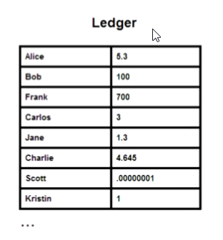
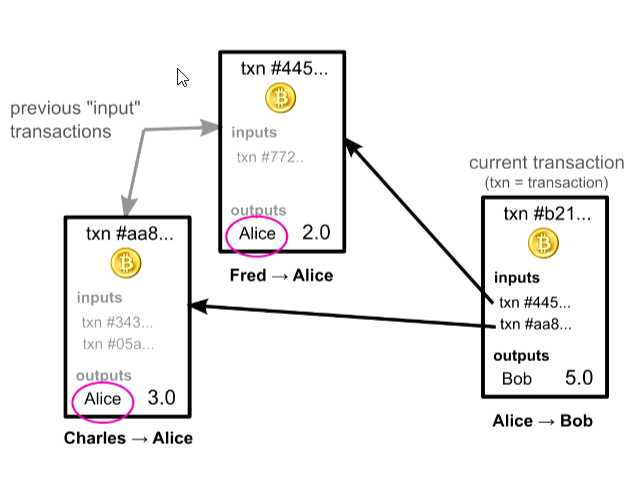
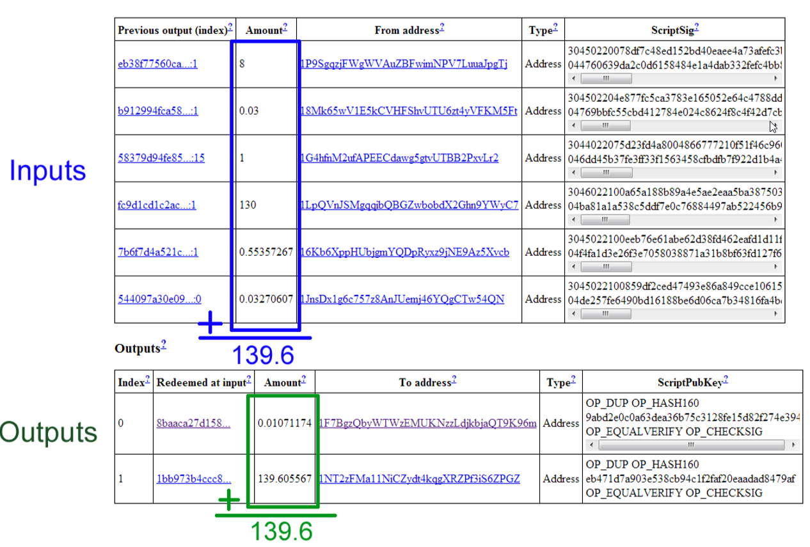
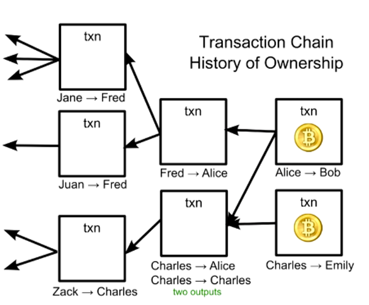
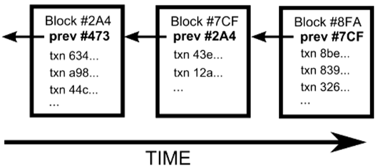
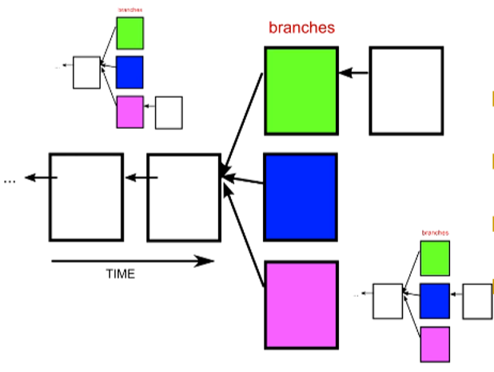
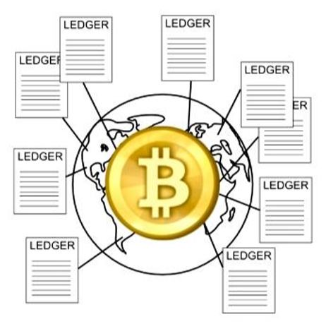

---
presentation:
  width: 1600
  height: 900
  slideNumber: 'c/t'
  showSlideNumber: "all"
  center: true
  enableSpeakerNotes: true
---

<!-- slide -->
# CRYPTOGRAPHY 密码学
### CRYPT-9 数字货币

<!-- slide -->
## Digital currency
- Exhibits properties similar to physical currencies, 
- but allows for instantaneous transactions and borderless transfer-ofownership 
- Both virtual currencies and cryptocurrencies are types of digital currencies, but the converse is incorrect. Like traditional money these currencies may be used to buy physical goods and services but could also be restricted to certain communities such as for example for use inside an on-line game or social network. 
- Virtual currency
- a type of unregulated, digital money, which is issued and usually controlled by its developers, and used and accepted among the members of a specific virtual community
- a medium of exchange that operates like a currency in some environments, but does not have all the attributes of real currency

<!-- slide -->
## Digital currency
- Virtual currency
    - European Central Bank: a type of unregulated, digital money, which is issued and usually controlled by its developers, and used and accepted among the members of a specific virtual community
    - The US Department of Treasury: a medium of exchange that operates like a currency in some environments, but does not have all the attributes of real currency
- Cryptocurrency
    - A type of digital token money that relies on cryptography for
        - Chaining together digital signatures of token transfers
        - Peer-to-peer networking and
        - Decentralization
        - Proof-of-work used to create and manage the currency

<!-- slide -->
## Cryptocurrency

- A digital asset designed to work as a medium of exchange using cryptography to secure the transactions and to control the creation of additional units of the currency. 
- Supposed to work in the environment of mutual untrust
- Bitcoin became the first decentralized cryptocurrency in 2009
- Bitcoin and its derivatives use decentralized control as opposed to centralized electronic money/centralized banking systems.
- The decentralized control is related to the use of bitcoin's blockchain transaction database in the role of a distributed ledger.

<!-- slide -->
## Typical situation
- Alice wants to buy Bob’s car
- They agreed with Bob on price 100 BTC 
- Alice registers transaction (-100 BTC from Alice’s balance, +100 BTC to Bob’s balance) 
- Howto: 
    - Make sure that Alice has enough funds 
    - Make sure that Bob cannot deny receiving the payment 
    - Prevent Alice from spending the same money for multiple transactions (double-spending) 
    - Prevent a third party from spending Alice’s funds
- Solution is based on such concepts as an decentralized secured ledge (blockchain), digitally signed transactions and proof-of-work scheme

<!-- slide -->
## Blockchain database

- A open distributed database that maintains a continuously growing list of ordered blocks. All nodes in the network maintain copies of the database 
- Each block contains a timestamp, a link to a previous block and a list of transactions 
- Blockchains are inherently resistant to modification of the data — once recorded, the data in a block cannot be altered retroactively

<!-- slide -->
## Proof-of-work
- In general: 
    - a challenge that is difficult to solve, but easy to check the solution 
- Generate a difficult computational challenge (for instance, an NP-hard problem) 
- All nodes in the network trying to solve the problem in parallel by choosing random solutions to be checked 
- The winner creates the new block and spreads it across the network 
    - Every node in the network validates the block independently 
- The winner is awarded an ammount of bitcons 
- The probability of two nodes to create new block at the same time is low, though possible: 
    - Avoiding creation of alternative new blocks 
    - If two alternative blocks were created, one of the blocks eventualy is accepted by every participant 
- The difficulty of the challenge is tunned automatically all the time so that the network finds new block in 10 minutes

<!-- slide -->
## Transaction

- A record containing info about change of the owner of an ammount of bitcoins 
- Inputs: 
    - Unspend values received by the payer earlier 
- Output: 
    - Unspend (exchange) of paying event 
    - Payed ammount to the payee, that he/she can use as input for his/her further transactions 
- The record is signed by the payer

<!-- slide -->
## How Sending Money in Bitcoin Works
- At a basic level, for Alice to send money to Bob, she simply broadcasts a message with the accounts and the amount    - Send 5.0 BTC from Alice to Bob 
- Every node that receives it will update their copy of the ledger, and then pass along the transaction message 
    - But how can the nodes be sure that the request is authentic, that only the rightful owner has sent the message?
        - Digital signature! 
- User’s ”account number” is his/her public key

<!-- slide -->
## How to verify your balance?

- In fact, no records of account balances are kept at all 
    - The exist only info on how much a user received and how much he/she spent earlier 
- Instead of balances, ownership of funds is verified through links to previous transactions

<!-- slide -->
## Transaction in details

- To send 5.0 BTC to Bob, Alice must reference other transactions where she received 5 or more Bitcoins 
- These referenced transactions are called “inputs.” 
- Other nodes verifying this transaction will check those inputs to make sure Alice was in fact the recipient, and also that the inputs add up to 5 or more Bitcoins

<!-- slide -->
## Transaction in details

<!-- slide -->
## Ownership passing chain

- This transaction references 6 inputs for a total of 139.6 Bitcoins 
- In the output section, notice that there are two lines 
    - The first one of these is actually going back to the sender as change for the transaction 
- A simplifying rule states that each input must be used up completely in a transaction 
    - if you’re trying to send an amount that doesn’t exactly match one of your inputs, you need to send any remaining amount back to yourself

<!-- slide -->
## Ownership passing chain validation

- Through these referenced input linkages, ownership of Bitcoins is passed along in a kind of chain, where the validity of each transaction is dependent on previous transactions 
- How can you trust those previous transactions? 
    - You can’t, and should check their inputs, too 
    - In fact, when you first install Bitcoin wallet software, it downloads every transaction ever made, and checks each one’s validity all the way back to the first transaction ever made

<!-- slide -->
## Ownership passing chain, double-spend validation
- Once a transaction has been used once, it is considered spent, and cannot be used again 
- When verifying a transaction, in addition to the other checks, nodes also make sure the inputs haven’t already been spent 
- For each input, nodes check every other transaction ever made to make sure that input hasn’t already been used before 
- While this may seem time consuming, as there are now over 20 million transactions, it’s made fast with an index of unspent transactions

<!-- slide -->
## Ownership passing chain, double-spend validation

Figuring out your own balance requires iterating through every transaction ever made and adding up all your unspent inputs

<!-- slide -->
## No mercy for errors
- As there is no bank or credit card company you can appeal to 
    - any “user-error” mistakes can result in the permanent loss of Bitcoins, not just from your own account, but from the Bitcoin economy overall 
    - If you lose your private key, any funds associated with the corresponding public key will be gone forever 
- Because people will likely lose private keys due to hard drive crashes and insufficient backups, this means the Bitcoin currency will eventually be a deflationary one

<!-- slide -->
## Anonymity and identity
- If you access Bitcoin through a TOR network that hides your IP address, you can use Bitcoin without ever revealing anything more than your public key 
- To avoid someone linking your transactions together (remember, they’re all publicly stored on every computer!), you can generate a new public key for every incoming transaction 
- Generating public key is anonymous, normaly unlinked to your true identity and can be done offline 
    - The public-private key pair is generated randomly 
    - Because there are so many different possible addresses, there’s no reason to even check if someone else already has that key 
    - In fact, if you did guess someone else’s key, you would have access to their money!

<!-- slide -->
## Double Spending in Bitcoin
- By verifying the Digital Signature, we know that only the true owner could have created the transaction message 
- To make sure the sender actually has money to spend, we also check each referenced input, making sure it is unspent 
- But there is still one large security hole in the system that can make this “unspent check” unreliable, and this has to do with the order of transactions.

<!-- slide -->
## Checking order of transactions
- Considering that transactions are passed node-by-node through the network, there’s no guarantee that the order in which you receive them represents the order in which they were created 
- you shouldn’t trust a timestamp because one could easily lie about the time a transaction was created 
    - Contrast this with a centralized system like paypal, where it’s easy for a central computer to keep track of the order of transactions

<!-- slide -->
## Transactions order

- You have no way to tell whether one transaction came before another, and this opens up the potential for fraud 
- For instance, a malicious user, Alice, could send a transaction giving money to Bob, wait for Bob to ship a product, and then send another transaction referencing the same “input” back to herself. 
- Because of differences in propagation times, some nodes on the network would receive the 2nd “double-spending” transaction before the one to Bob. 
- When Bob’s transaction arrived, they would consider it invalid because it’s trying to reuse an input. 
- Overall, there would be disagreement across the network about whether Bob or Alice had the money, because there’s no way to prove which transaction came first

<!-- slide -->
## Transactions order

<!-- slide -->
## The Block Chain: an Ordering of Transactions
- There needs to be a way for the entire network to agree about the order of transactions 
- Bitcoin’s solution is a clever way to both determine and safeguard the ordering through a kind of mathematical race 
- The Bitcoin system orders transactions by placing them in groups called blocks, and linking those blocks together in something called the block chain 
    - Note that this is different from the transaction chain 
    - The block chain is used to order transaction, whereas the transaction chain keeps track of how ownership changes

<!-- slide -->
## The Block Chain
Each block has a reference to the previous block, and this is what places one block after another in time 
- You can traverses the references backwards all the way to the very first group of transactions ever made 
- Transactions in the same block are considered to have happened at the same time, and transactions not yet in a block are called “unconfirmed,” or unordered

<!-- slide -->
## The Block Chain
- Any node can collect a set of unconfirmed transactions into a block, and broadcast it to the rest of the network as a suggestion for what the next block in the chain should be 
- Because multiple people could create blocks at the same time, there could be several options to choose from, so how does the network decide which should be next? 
- We can’t rely on the order that blocks arrive, because, as explained with transactions above, they may arrive in different orders at different points in the network

<!-- slide -->
## Creating new blocks
- Each valid block must contain the answer to a very special mathematical problem 
- Run the entire text of a block plus an additional random guess through hash function (32 bytes, SHA256) until the output is below a certain threshold 
- With every computer in the entire Bitcoin network all guessing numbers, it takes about 10 minutes on average for someone to find a solution 
- The first person to solve the math problem broadcasts their block, and gets to have their group of transactions accepted as next in the chain. The randomness in the math problem effectively spreads out when people find a solution, making it unlikely that two people will solve it at the same time

<!-- slide -->
## Multiple branches

- Occasionally, however, more than one block will be solved at the same time, leading to several possible branches 
- In this case, you simply build on top of the first one you received. Others may have received the blocks in a different order, and will be building on the first block they received

<!-- slide -->
## Multiple branches

- The tie gets broken when someone solves another block 
- You always immediately switch to the longest branch available 
- It is rare for blocks to be solved at the same time 
- the block chain quickly stabilizes across the network

<!-- slide -->
## Double Spending in the Block Chain
- The fact that there’s some ambiguity in the end of the chain has some important implications for transaction security 
- For instance, if your transaction finds itself in one of the shorter branches, it will lose its place in line within the block chain 
- This means it will just go back into the pool of unconfirmed transactions, and be included in a later block 
- This opens the door to the very double-spend attack

<!-- slide -->
## Double Spending in the Block Chain
- A fraudster, Alice, sends money to Bob 
- Bob then waits for the transaction to get “confirmed” into the block chain, and then ships a product 
- Now, because nodes always switch to a longer branch, if Alice can generate a longer branch that replaces the transaction to Bob with one to someone else, his money will effectively get erased 
- Bob’s transaction will initially get tossed back into the unconfirmed pool 
- But since Alice has replaced it with another transaction that uses its same input, nodes will now consider Bob’s transaction invalid, because it’s referencing an already spent input

<!-- slide -->
## Double Spend Prevention
- You might think that Alice could pre-compute a chain of blocks to spring on the network at just the right time, but the math puzzles in each block actually prevent this 
- She can only start solving blocks once the block she wants to build on is solved, and its hash value is known 
- She is therefore in a race with the rest of the network until Bob ships a product, which is when she wants to present a longer branch 
- She must work in private, because if Bob heard about her double spend block, he would obviously not ship the product 
- One last question is whether Alice might be able to outpace everyone if she had an extremely fast computer, or perhaps a room full of computers 
    - even with thousands of computers, she would be unlikely to win the race to solve a block, because she isn’t racing any one computer, but rather the entire network 
    - She would need to control half of the total computing power in the entire network to have a 50% chance of solving a block before someone else

<!-- slide -->
## Double Spend Prevention

<!-- slide -->
## Double Spend Prevention
- Transactions in the block chain are protected by a mathematical race 
- One that pits an attacker against the entire rest of the network 
- A consequence of blocks building on top of each other is that transactions further back in the chain are more secure 
- The system is only vulnerable to a double spend attack near the end of the chain, which is why it’s recommended to wait for several blocks before considering received money final

<!-- slide -->
## No trust needed
- Amazingly, nothing described so far requires any trust 
- When you receive information from strangers in the Bitcoin network, you can check for yourself that the block solutions are correct 
- Because the math problems are so hard, you know that there’s no way any attacker could have generated them on their own 
- The solutions are proof that the computing power of the entire network was brought to bear

<!-- slide -->
## Where new bitcoins come from?
- To send money, you must reference a previous transaction where you were the recipient, but how do coins get into this ownership chain in the first place? 
- As a way to slowly and randomly generate and distribute coins, a “reward” is given to whoever solves a block 
- This is why solving blocks is called mining, although its real purpose is to verify transactions, and safeguard the block chain  Every 4 years, the block reward is cut in half, so eventually no more coins will be released 
    - about 21 million in total will be created 
- In addition to the block reward, miners also get any transaction fees that can optionally be included with transactions. 
    - Right now, miners will include transactions with no fees into blocks because their main incentive is the block reward, 
    - but in the future, transactions will likely be processed in order of the fees attached, and ones without fees will likely be ignored. 
    - Sending money in Bitcoin will probably not be free, but will hopefully still be cheaper than current credit card fees

<!-- slide -->
## Mining pools
- On average, it would take several years for a typical computer to solve a block 
- An individual’s chance of ever solving one before the rest of the network, which typically takes 10 minutes, is very low 
- To receive a steadier stream of income, many people join groups called mining pools that collectively work to solve blocks, and distribute rewards based on work contributed 
- These act somewhat like lottery pools among co-workers, except that some of these pools are quite large, and comprise more than 20% of all the computers in the network
- The fact that some of these pools are so large has some important implications about security 
- It’s very unlikely for an attacker to solve several blocks in a row faster than the rest of the network, but it is possible, and the probability increases as the attacker’s processing power gains in proportion to the rest of the network 
- In fact, one of the mining pools, BTC Guild, has solved 6 blocks in a row by itself, and has voluntarily limited its members to ward off distrust of the entire bitcoin network

<!-- slide -->
## Mining pools

<!-- slide -->
## Recommended wait time
- The current recommendation is to wait for a transaction to make it into at least one block, or get one confirmation, before considering it final 
- For larger transactions, wait for at least 6 blocks or longer

<!-- slide -->
## Confirmation Time
- By design, each block takes about 10 minutes to solve, so waiting for 6 blocks would take about an hour 
- Compared to the several seconds a credit card transaction takes, waiting this long for a confirmation may seem burdensome 
    - However, keep in mind that credit card customers can claim a stolen card months later to have charges reversed from merchants (called charge backs) 
    - In this way, Bitcoin is actually much faster from a merchant’s perspective 
- The particular choice of 10 minutes was chosen to avoid instability and delayed confirmation times 
- As more computers join the network, and specialized hardware is designed specifically for mining, the block solution time would get very small 
    - To compensate, every two weeks, all the Bitcoin software recalibrates the difficulty of the math problem to target 10 minutes

<!-- slide -->
## Conclusion

- Bitcoin is a mathematically protected digital currency that is maintained by a network of peers 
- Digital Signatures authorize individual transactions, ownership is passed via transaction chains, and the ordering of those transactions protected in the Block Chain 
- By requiring difficult math problems to be solved with each block, would-be attackers are pitted against the entire rest of network in a computational race they are unlikely to win

